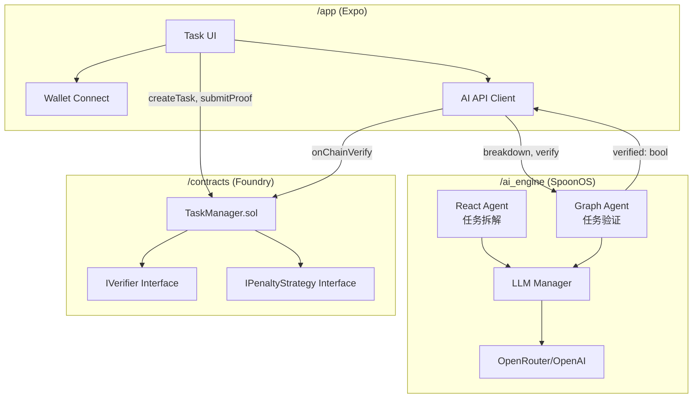

# Design Document: FocusFlow 黑客松版

## Overview

本设计文档描述 FocusFlow 的三层架构实现：**智能合约层**、**AI Agent 层**、**移动前端层**。核心设计原则是**模块化与扩展性优先**，确保 MVP 快速交付的同时为未来功能（如多链支持、社交对赌、NFT 勋章市场）预留接口。

---

## Architecture

### 系统架构图



---

## Modular Design Principles (扩展性保障)

### 🔌 接口抽象 (Interface Abstraction)

为未来扩展预留以下核心接口：

| 接口名 | 职责 | 扩展场景 |
| :--- | :--- | :--- |
| `IVerifier` | 定义验证逻辑 | 未来可支持 DAO 投票验证、Chainlink Oracle 验证等 |
| `IPenaltyStrategy` | 定义惩罚策略 | 未来可支持捐赠慈善、分红给其他用户、销毁等 |
| `IRewardStrategy` | 定义奖励策略 | 未来可支持 NFT 勋章、积分发放等 |

> [!IMPORTANT]
> MVP 阶段：仅实现 `SimpleAIVerifier` (纯信任 AI 结果) 和 `BurnPenalty` (销毁资金)。接口已预留，后续可无缝替换。

---

## Components and Interfaces

### 1. 智能合约层 (`/contracts`)

#### TaskManager.sol (核心合约)
- **Purpose:** 管理任务生命周期（创建、验证、结算）。
- **Interfaces:**
  ```solidity
  function createTask(string memory description, uint256 deadline) external payable;
  function submitProof(uint256 taskId, bool verified) external; // 仅限 Verifier 调用
  function claimRefund(uint256 taskId) external;
  function settle(uint256 taskId) external; // 任何人可触发逾期结算
  ```
- **Dependencies:** `IVerifier`, `IPenaltyStrategy`
- **扩展点:** 通过构造函数注入 Verifier 和 PenaltyStrategy 地址。

#### IVerifier.sol (接口)
```solidity
interface IVerifier {
    function verify(uint256 taskId, address user, bytes calldata proof) external returns (bool);
}
```

#### IPenaltyStrategy.sol (接口)
```solidity
interface IPenaltyStrategy {
    function execute(uint256 taskId, address user, uint256 amount) external;
}
```

### 2. AI Agent 层 (`/ai_engine`)

#### BreakdownAgent (React Agent)
- **Purpose:** 接收任务描述，返回拆解后的子任务列表。
- **Input:** `{ task: string }`
- **Output:** `{ subtasks: [{ title: string, estimatedMinutes: number }] }`
- **扩展点:** 可增加外部工具（如 Google Calendar API）自动排期。

#### VerifyAgent (Graph Agent)
- **Purpose:** 接收用户证明（文字/图片），返回验证结果。
- **Graph 节点:**
  1. `InputNode`: 解析用户输入。
  2. `VisionNode`: (可选) 调用 Vision 模型分析图片。
  3. `DecisionNode`: 判定完成度是否 >= 80%。
  4. `OutputNode`: 返回 `{ verified: bool, reason: string }`。
- **扩展点:** 可将 `OutputNode` 改为直接调用链上 `submitProof` (需托管私钥，MVP 不实现)。

### 3. 前端层 (`/app`)

#### Screens
- `HomeScreen`: 显示任务列表和统计。
- `CreateTaskScreen`: 任务创建 + 质押流程。
- `TaskDetailScreen`: 任务详情 + 提交证明 + AI 验证。

#### Services (可复用模块)
- `wallet.service.ts`: 封装 Wagmi/Viem 钱包连接逻辑。
- `ai.service.ts`: 封装与 SpoonOS 的 HTTP 通信。
- `contract.service.ts`: 封装与 TaskManager 合约的交互。

---

## Data Models

### Task (链上)
```solidity
struct Task {
    uint256 id;
    address owner;
    string description;
    uint256 stakeAmount;
    uint256 deadline;
    TaskStatus status; // Pending, Verified, Failed, Settled
}
```

### TaskUI (前端)
```typescript
interface TaskUI {
    id: number;
    description: string;
    stakeAmount: bigint;
    deadline: Date;
    status: 'pending' | 'verified' | 'failed' | 'settled';
    subtasks?: Subtask[]; // AI 拆解结果
}
```

---

## Error Handling

| 场景 | 处理方式 | 用户体验 |
| :--- | :--- | :--- |
| 钱包余额不足 | 合约 `revert` | 前端提示"余额不足" |
| AI 服务不可用 | 捕获超时，允许手动重试 | 显示"AI 暂时繁忙，请稍后再试" |
| 链上交易失败 | 捕获 `revert` reason | 显示具体错误原因 |
| 验证结果争议 | MVP 不处理，信任 AI | 未来可引入 DAO 申诉机制 |

---

## Testing Strategy

### Unit Testing
- **合约:** 使用 Foundry `forge test`，覆盖 `createTask`, `settle`, `submitProof`。
- **Agent:** 使用 `pytest` 测试 `BreakdownAgent` 输出格式。

### Integration Testing
- **端到端流程:** 使用 Anvil 本地链 + 模拟前端调用，验证完整流程。

### E2E Testing
- **用户场景:** 手动测试"创建任务-质押-提交证明-验证成功-退款"流程。
