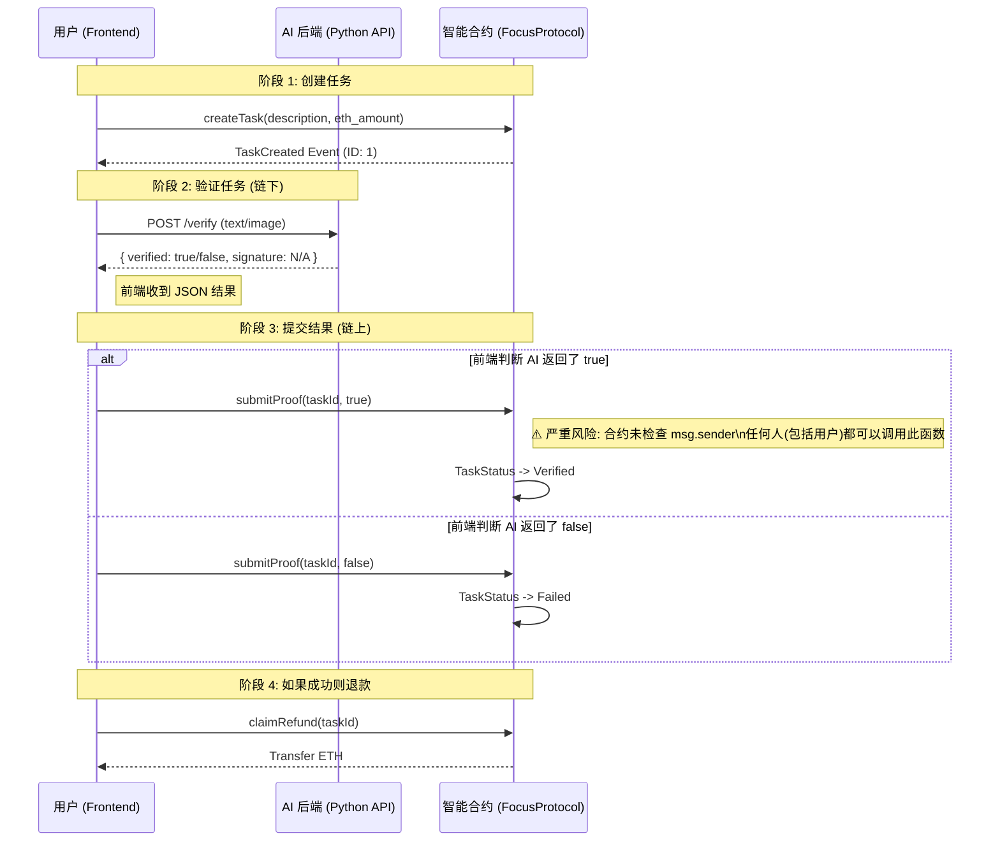

# FocusFlow 架构图集 (基于现状代码)

> **⚠️ 警告**: 以下图表真实反映了当前代码 (`commit: feat: setup Vercel...`) 的实现逻辑。
> **发现偏差**: 当前实现与理想架构存在显著差异，特别是在安全性方面（用户充当了 Oracle 的中继者，且合约未做权限检查）。

## 1. 智能合约层逻辑流程 (实际现状)



## 2. 全系统分层架构图 (实际现状)

```mermaid
graph TD
    subgraph "Local Execution (User Device)"
        FE[React Native App]
        Wallet[Wallet (Signer)]
    end

    subgraph "Backend Services (Off-chain)"
        API[Python API (FastAPI)]
        LLM[(LLM Engine)]
    end

    subgraph "Blockchain (Testnet/Local)"
        Contract[Task Manager Contract]
    end

    %% 真实的数据流向
    FE -->|"1. User Clicks"| API
    API -->|"2. Return Result"| FE
    FE -->|"3. User Signs Tx"| Wallet
    Wallet -->|"4. Call Contract"| Contract
    
    %% 关键差异标注
    style FE fill:#ffccbc,stroke:#bf360c,stroke-width:2px;
    style API fill:#e1bee7,stroke:#4a148c,stroke-dasharray: 5 5;
    style Contract fill:#c8e6c9,stroke:#1b5e20,stroke-width:2px;

    Note1[🔍 偏差: Agent 并不直接连接合约<br/>前端 App 充当了中继器]:::note
    Note1 -.-> FE
    
    classDef note fill:#fff9c4,stroke:#fbc02d,stroke-width:1px;
```
