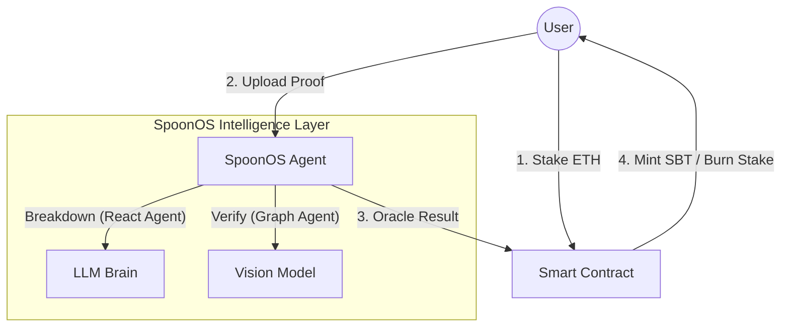

# FocusFlow — Mint Your Future Self

> **赌注驱动的专注力协议** (Stake-Driven Productivity Protocol)
>
> *Powered by **SpoonOS** | Mint Your Future Self*

[](https://github.com/spoon-ai/spoon-core)
[](https://expo.dev/)
[](https://getfoundry.sh/)

---

## 📖 目录 (Table of Contents)

1. [核心价值 (Core Value)](#1-核心价值-core-value)
2. [SpoonOS 深度集成 (Role of SpoonOS)](#2-spoonos-深度集成-role-of-spoonos)
3. [商业闭环与招聘 (The Flywheel)](#3-商业闭环与招聘-the-flywheel)
4. [竞品对比 (Web2 vs Web3)](#4-竞品对比-web2-vs-web3)
5. [技术架构 (Tech Stack)](#5-技术架构-tech-stack)
6. [部署指南 (Deployment)](#6-部署指南-deployment)
7. [演示剧本 (Demo Script)](#7-演示剧本-demo-script)

---

## 1. 核心价值 (Core Value)

我们卖的不是“任务管理工具”，而是**“链上履历”**。

**FocusFlow** 是一个 **赌注驱动 (Stake-Driven)** 的去中心化成就验证协议。

我们认为：**没有赌注的承诺是廉价的**。
因此，我们结合了“Web3 金融对赌”作为**手段 (How)**，与“SpoonOS AI 审计”作为**验证 (Verify)**，共同构建了“Proof of Effort”这一**愿景 (Why)**。

用户通过质押真金白银来倒逼自己行动，而这些被 AI 验证过的行动，最终会被铸造成不可篡改的链上履历（SBT）。

### Why Us?
*   **Web2 做不到**：Keep 或 Forest 只能给你虚拟勋章，数据孤岛化且易作弊。
*   **Web3 做到了**：引入 **“真金白银的抵押 (Staking)”** + **“SpoonOS 的严格审计 (AI Audit)”**。双重验证机制让“成就数据”具有极高的含金量。

---

## 2. SpoonOS 深度集成 (Role of SpoonOS)

SpoonOS 不是配角，它是这个系统的 **“首席执行官”和“最高法官”**。

### 🏗️ 1. The Architect (架构师) - AI Native Planning
*   **Narrative**: 用户想“精通 Solidity”，但不知从何入手。SpoonOS 利用 **React Agent** 检索最新路线图，将模糊目标拆解为 5 个里程碑和具体的可执行任务 (Actionable Tasks)。
*   **Tech Highlight (Provider Agnostic)**:
    *   我们的 Agent 基于 Spoon Core 抽象层构建。
    *   **优势**: 业务逻辑与模型解耦。这意味着我们可以根据任务难度动态切换底层大脑（简单任务用 GLM-4 Flash，复杂推理用 Claude 3.5 Sonnet），在成本与智商之间找到最优解，且具备抗审查性。

### ⚖️ 2. The Judge (法官) - Multimodal Visual Oracle
*   **Narrative**: 链下行为（看书、写代码）极其难以验证。SpoonOS 利用 **Graph Workflow** 充当了“视觉预言机”。
*   **Tech Highlight (Native Multimodal)**:
    *   传统的 Oracle 只能喂入文本数据。
    *   **FocusFlow Innovation**: 我们利用 SpoonOS 的多模态消息架构 (`MultimodalMessage`)，直接将用户拍摄的**“手写笔记”**或**“代码屏幕”**作为 Payload 喂入 VLM (Vision Language Model)。
    *   **流程**: `Image Input` -> `Spoon VLM` -> `Semantic Analysis` -> `Deterministic JSON Result`。

### 🌉 3. The Bridge (连接器) - Deterministic Output
*   **Narrative**: AI 的输出是模糊的 (Fuzzy)，但区块链需要精确的 (Deterministic)。
*   **Tech Highlight**:
    *   SpoonOS Agent 被配置为输出严格的 JSON 结构 (`VerifyResult`)。
    *   它充当了 **"Reality-to-Chain Translator"**：将非结构化的物理世界证明（图片/行为）翻译成区块链能读懂的 Transaction 数据 (bool verified)，从而触发智能合约的资金结算。

> **我们不验证过程，我们验证内化后的结果。**

---

## 3. 商业闭环与招聘 (The Flywheel)

如何把“痛苦的自律”变成“高价值的资产”？

### 💰 Loop 1: Productivity-Fi (金融闭环)
*   **Input**: 用户质押 ETH。
*   **Process**: 资金锁定在合约中产生 DeFi 利息 (Yield)。
*   **Output**: 
    1.  **无损彩票**: 成功者拿回本金 + 瓜分失败者的质押金 (Jackpot)。
    2.  **协议收入**: 平台抽取 Yield 利息及“后悔药（延时卡）”费用。

### 🎓 Loop 2: Proof of Skill (人才闭环)
*   **现状**: 简历全是水分，HR 无法验证“精通 Solidity”的真实性。
*   **FocusFlow 解法**: 当用户积攒了 10 个 "Solidity Task" 的 **Verified SBT**，这就构成了 **Proof of Skill**。
*   **变现**: 开放 API 给招聘平台 (DeJob, LinkedIn)。企业付费查询用户的“真实执行力数据”。

---

## 4. 竞品对比 (Web2 vs Web3)

| 维度 | Web2 自律 App (Keep/Forest) | FocusFlow (基于 SpoonOS) |
| :--- | :--- | :--- |
| **核心驱动力** | 弱多巴胺 (虚拟徽章) | **强多巴胺** (金钱得失 + 职业未来) |
| **作弊成本** | 极低 (无后果) | **极高** (损失本金 + 毁坏链上信誉) |
| **验证方式** | 简单的勾选或传感器 | **SpoonOS AI 深度审计** + 交互式拷问 |
| **数据价值** | 数据孤岛，无法带走 | **链上 SBT**，可组合的“能力护照” |
| **商业模式** | 卖会员/广告 (收割用户) | **DeFi Yield + 招聘抽成** (成就用户) |

---

## 5. 技术架构 (Tech Stack)



*   **Frontend**: React Native (Expo) - 原生级体验
*   **Backend**: Python (FastAPI) + **SpoonOS SDK**
*   **Contract**: Solidity (Foundry) - 资金与 SBT 管理

---

## 6. 部署指南 (Deployment)

由于本项目涉及区块链、AI 后端、移动端三个独立服务，建议打开 4 个终端窗口运行。

#### Terminal A: 启动本地链
```bash
# 务必使用 --chain-id 1337 (保持 symbol 为 ETH)
anvil --chain-id 1337
```

#### Terminal B: 部署合约
```bash
cd contracts
# 注意：需替换 --private-key 为你的 Anvil 私钥
forge script script/Deploy.s.sol --rpc-url http://127.0.0.1:8545 --broadcast --private-key 0xac0974bec39a17e36ba4a6b4d238ff944bacb478cbed5efcae784d7bf4f2ff80
```

#### Terminal C: 启动 AI 引擎 (SpoonOS)
```bash
cd ai_engine
# 1. 创建环境
python3 -m venv .venv
source .venv/bin/activate
# 2. 安装依赖
pip install -r requirements.txt
# 3. 启动服务 (需配置 .env)
python api.py
```
> 服务端口: `http://localhost:8000`

#### Terminal D: 启动 App
```bash
cd app
npm install
npx expo start
```
> 按 `w` 预览网页，或 `i` 启动模拟器。

---

## 7. 演示剧本 (Demo Script)

1.  **誓师 (Staking)**: Alice 输入“一周学完 Foundry”，质押 0.1 ETH。“这一刻，她没有退路了。”
2.  **拆解 (Breakdown)**: SpoonOS 介入，将大目标拆解为 3 个可执行任务。
3.  **验证 (Verification)**: Alice 上传代码。SpoonOS 弹出：“请 30 秒内解释这段代码。” -> Alice 答对。
4.  **荣耀 (Settlement)**: 合约退还本金，一枚像素风 **"Foundry Novice" SBT** 飞入 Alice 钱包。
5.  **未来**: 招聘网站上，Alice 的简历旁显示 **"Verified by FocusFlow"** 金色认证。

---

*Built for Hackathon 2026*
